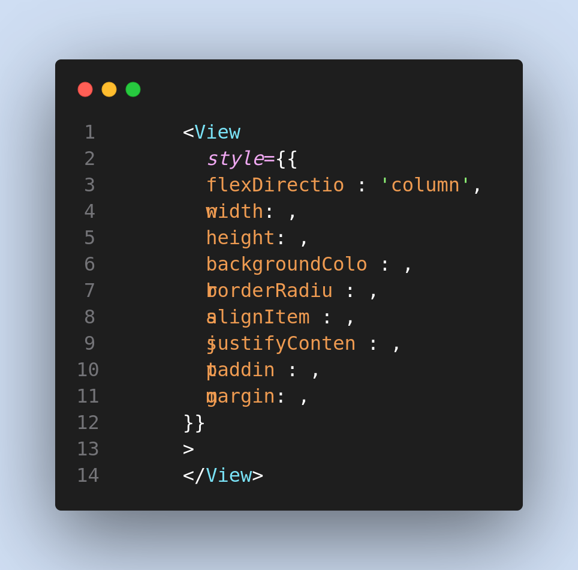
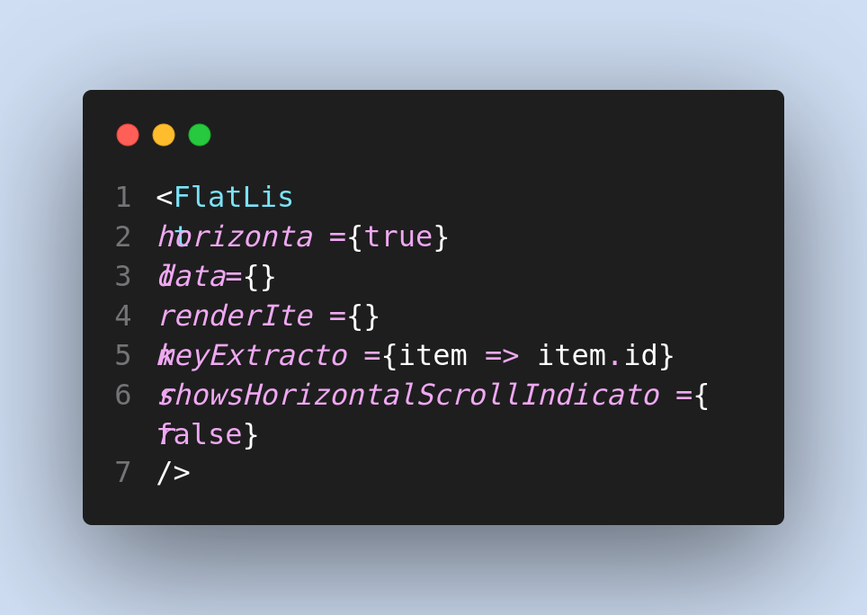

# Custom React Native Snippets

This repository contains few of the snippets that i use in my react native videos on my youtube channel.

## Setup Instructions (VSCODE)

- Open Visual Studio Code

- CODE (<kbd>Ctrl</kbd>+<kbd>Shift</kbd>+<kbd>p</kbd>)> PREFERENCES > USER SNIPPETS > create new or find exists

- Copy the code from this repository into that file.

## Snippets

| Snippet | Renders                              |
| ------- | ------------------------------------ |
| `v`     | View Component                       |
| `vs`    | View Component with with empty style |
| `vcs`   | View Component with common styles    |
| `t`     | Text Component                       |
| `tcs`   | Text component with common styles    |
| `ti`    | TextInput Component                  |
| `fl`    | FlatList Component vertical          |
| `flh`   | FlatList Component Horizontal        |

